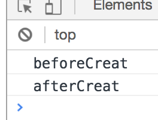

# 原生js实现省市区三级联动插件

## 前言
插件功能只满足我司业务需求，如果希望有更多功能的，可在下方留言，我尽量扩展！
> [仓库地址]()

> [在线预览]()

### 准备
```html
<div id="wrap"></div>
```
页面中的容器标签不限制，只需给个id就行

```javaScript
var address = new Address({
    wrapId: 'wrap',
    showArr: ['provinces','citys','areas'],
    beforeCreat:function(){
        console.log("beforeCreat")
    },
    afterCreat:function(){
        console.log('afterCreat');
    }
})
```

- `wrapId:"wrap" // 此处的wrap就是上面容器的id `
- `showArr: ['provinces','citys','areas'] // 此处分别代表省市区的id  `
> 举个例子：如果传递的数组`['provinces','citys','areas']`长度为3，那么将会出现省市区，数组中三个字符串分别是省、市、区容器的id
> 如传递的数组`['provinces','citys']`长度为2个，那么将会出现省市，数组中的两个字符串分别是省、市容器的id 
> 如数组长度为1的时候就不说了

- `beforeCreat` 插件开始创建前执行的回调函数
- `afterCreat` 插件创建完成后执行的回调函数

> 

###预览


## 总结
如有什么功能需要增加的，可在评论区留言，我尽量满足。如有什么疏忽或错误，希望您指出。我会尽早修改，以免误导他人。
